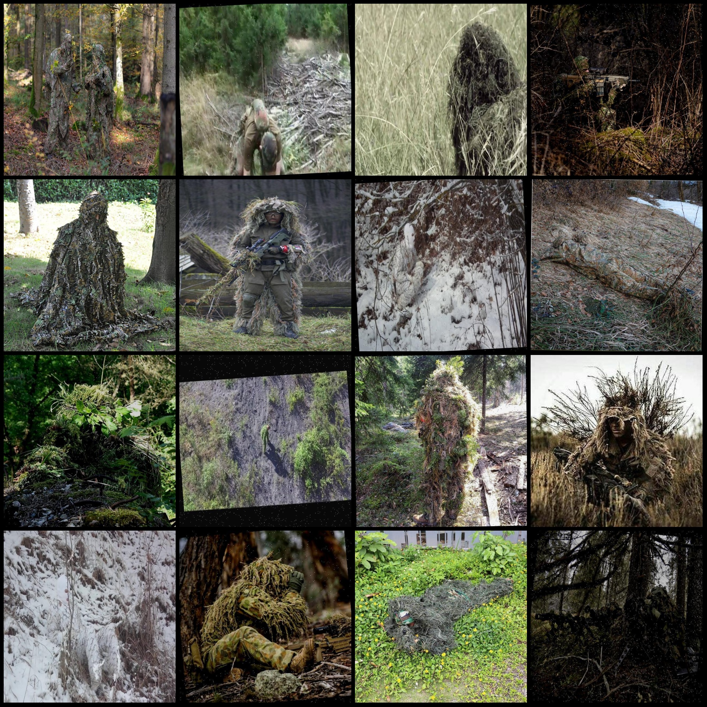
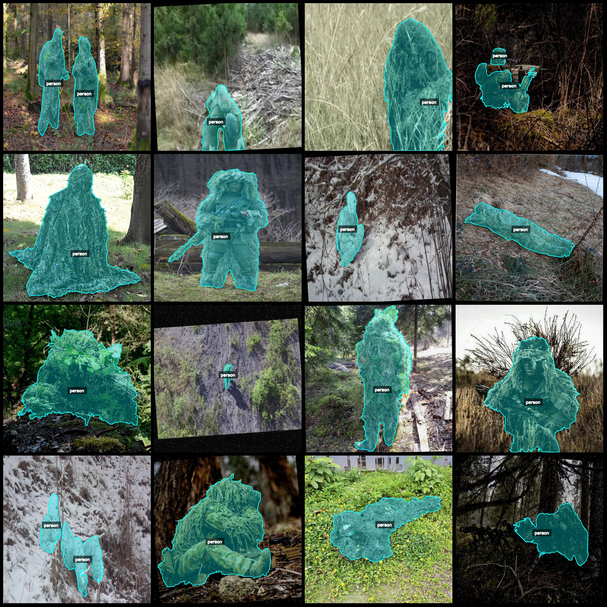
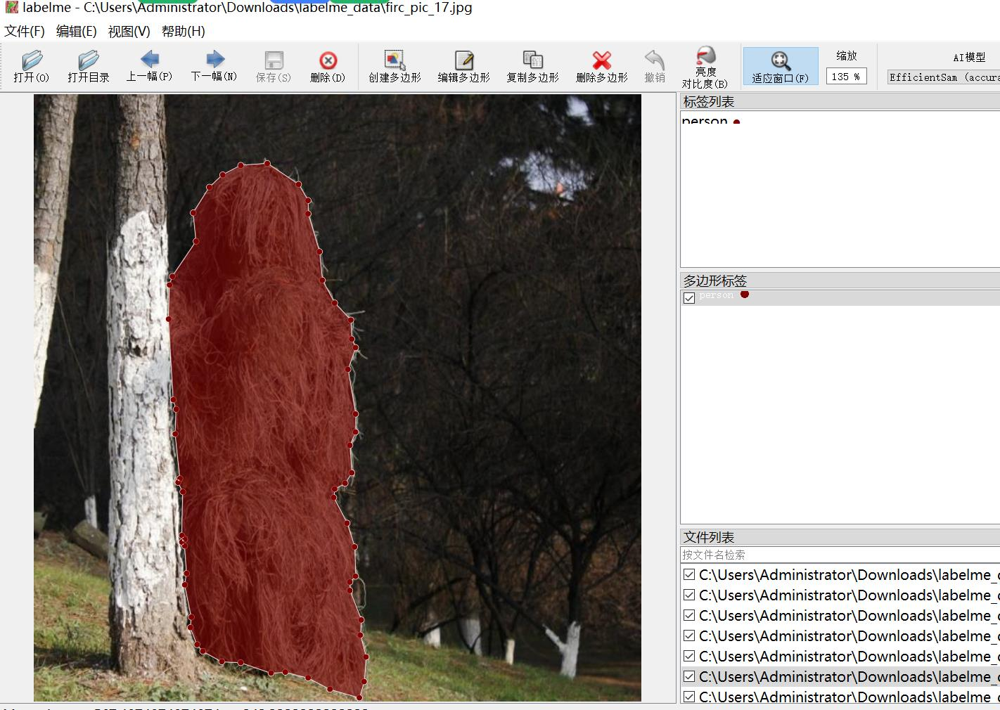

# Camouflage Counterfeit Recognition and Separation Dataset - LabelMe Format: 868 images, 1 category

Note that some images in the dataset have been enhanced.
Dataset format: labelme format (excluding mask files, just containing jpg images and corresponding json files).
Number of images (number of jpg files): 868
Number of annotations (number of json files): 868
Number of categories: 1
Category name: "person"
Number of bounding boxes per category:
person count = 1136
Total number of bounding boxes: 1136
Annotation tool used: labelme v5.5.0
Image resolution: 640x640
Annotation rules: Polygons are drawn around the categories.
Important note: The dataset can be edited using labelme, but the json data set needs to be converted into either a mask or Yolo/COCO format for semantic segmentation or instance segmentation.
Special statement: This dataset does not guarantee the accuracy of the trained models or weight files.
Image preview:
Annotation examples:
Randomly selected 16 images (for example):
Annotation drawing results:
Labelme editing image example:

## Images

Here is a pay link on Stripe ( https://buy.stripe.com/3cs8yP7sY87d0vu9AB ). Please contact me lonlonago@foxmail.com after funding $89, and I will send you a complete data files , thank you!

